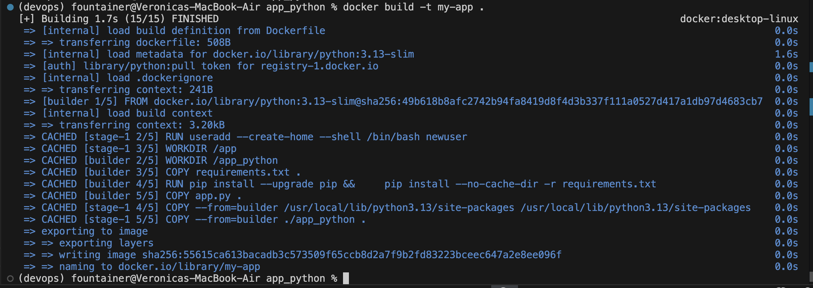
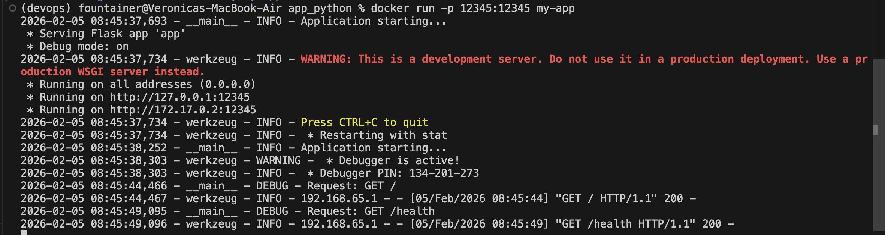
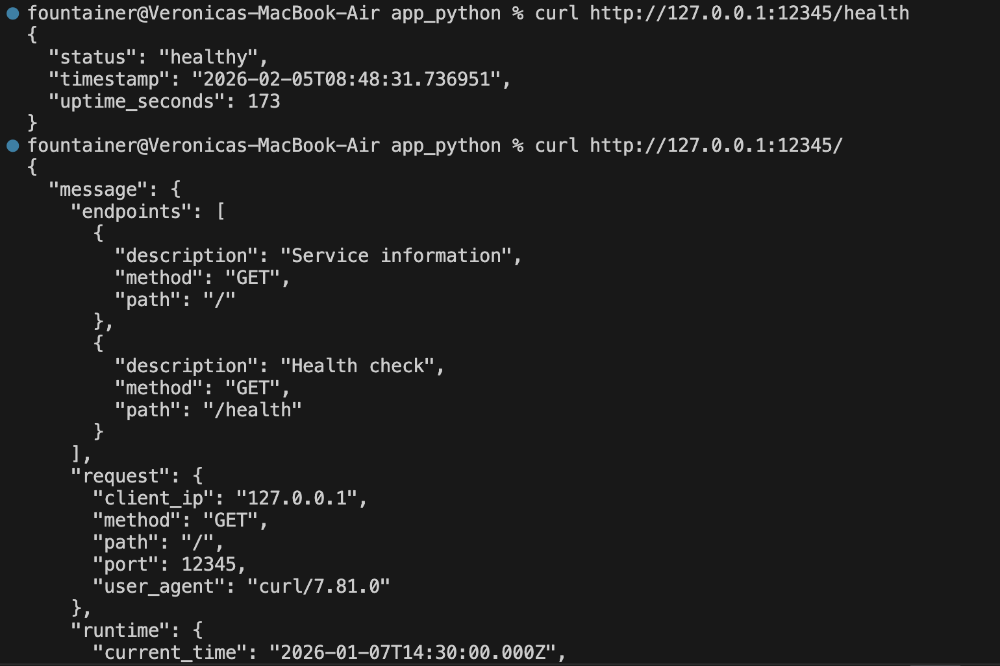
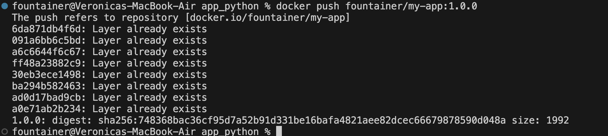
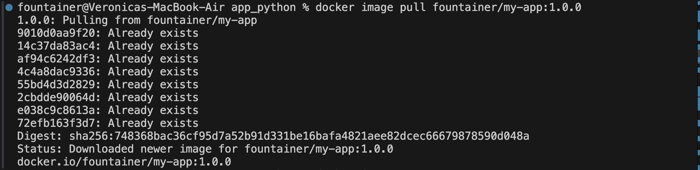

# Documentation

## Docker Best Practices Applied

- COPY commands for copying requirements before copying application code. This is a good practice because this way if we change the application code we won't have to rebuild all dependencies.

```bash
COPY requirements.txt . 
COPY app.py .
```
- Multi-stage image. Firstly we build an image, then we run commands. It helps to reduce the final image size since all build tools won't be included. Example is the whole Dockerfile.

- Small base image (python:3.13-slim), this way image builds faster since we don't need to install a giant package. 

- Creating and setting a non-root user. This is good for security since running as root is vulnerable.

```bash
RUN useradd --create-home --shell /bin/bash newuser
USER newuser
```
- .dockerignore file. We explicitly exclude files that should not be leaked to the public image (for security).

- COPY only those files that are really needed (application code and dependencies).

```bash
COPY requirements.txt .
COPY app.py . 
```
- EXPOSE port for documentation purposes. 

```bash
EXPOSE 12345
```

## Image Information & Decisions

- I chose python:3.13-slim because it is really small compared to the full version and was released not so long ago (I thought about using a distroless image, but the last available version was 3.12).

- Final image is 158MB, it is very light (compressed size in dockerhub is even smaller: 47.32 MB)

- Layer structure: I use multi-stage Dockerfile, so I have two parts: for building and for running. In the build stage I copy all dependencies and then application code, in the run-time stage I set an environment variable for the port, document it, add a new user and create a directory, then copy files with dependencies and application code, and then run commands. This way the time for building is utilised in an effective manner due to the small image, copy commands order, and multi-stage dockerfile.

## Build & Run Process











[Link to the image](https://hub.docker.com/repository/docker/fountainer/my-app/general)

## Technical Analysis

### Why does your Dockerfile work the way it does?

Because Dockerfile provides a clear structure that can be easily followed and suited for your particular needs. It works the way it does because it replicates how the script is running on the host machine.

### What would happen if you changed the layer order?

If I change the COPY commands order after I make changes in application code all dependencies will be rebuilt too. If I remove the multi-stage the size of the image will increase.

### What security considerations did you implement?

Non-root user, .dockerignore, copying specific files.

### How does .dockerignore improve your build?

It excludes the possibility to copy files that contain private information (but we still can forget to add some files so it is better to only copy what we actually need).

### Challenges & Solutions

- I faced a problem with port mapping but docker documentation helped. Now I know how to set up the communication between host and container. While I was struggling I tried to debug what processes blocked the 5000 port (and it seemed to be docker itself).


