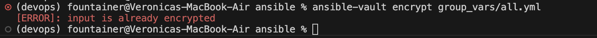

# Documentation

## Architecture Overview

### Ansible version used

core 2.20.2

### Target VM OS and version

linux, ubuntu-2204-lts

### Role structure diagram or explanation

```
roles/
├─ app_deploy/                # deploying the application
│  ├─ defaults/main.yml       # default variables: container_port, restart_policy, app_env, etc
│  ├─ handlers/main.yml       # handlers, for example, restart container
│  └─ tasks/main.yml          # deployment tasks
│
├─ docker/                    # docker setup/configuration
│  ├─ defaults/main.yml       # defaults for docker config
│  ├─ handlers/main.yml       # docker handlers
│  └─ tasks/main.yml          # tasks to install and configure docker
│
├─ common/                    # general tasks
│  ├─ defaults/main.yml       # default variables for common tasks
│  ├─ handlers/main.yml       # handlers for common tasks
│  └─ tasks/main.yml          # general-purpose tasks shared across roles
```

### Why roles instead of monolithic playbooks?

- Roles can be used across different projects, thay are easy to configure and control, as well as to change if needed.

## Roles Documentation

### Common

- Purpose: installs common packages and sets system timezone
- Variables: common_packages (default: vim, git, curl, python3-pip, htop), timezone_name (default: Europe/Moscow)
- Handlers: doesn't have
- Dependencies: doesn't have

### Docker

- Purpose: installs and configures docker engine, ensures service is running, adds user to docker group, and sets up python for ansible
- Variables: docker_packages (docker-ce, docker-ce-cli, containerd.io), docker_user (default: ubuntu), docker_gpg_url, docker_repo
- Handlers: restart docker – restarts docker service when notified
- Dependencies: doesn't have

### App_deploy

- Purpose: deploys the application container: logs in to Docker Hub, pulls the image, stops/removes old container, runs new container, waits for it to be ready, and verifies health
- Variables: Vaulted: dockerhub_username, dockerhub_password, app_name, docker_image_tag, app_port, app_container_name; Defaults: container_port, restart_policy, app_env
- Handlers: restart app container – restarts the application container when notified
- Dependencies: depends on Docker being installed and configured (accomplished with docker role)

## Idempotency Demonstration

### Terminal output from FIRST provision.yml run

```bash
(devops) fountainer@Veronicas-MacBook-Air ansible % ansible-playbook playbooks/provision.yml

PLAY [Provision web servers] *********************************************************************************************************************************************************

TASK [Gathering Facts] ***************************************************************************************************************************************************************
ok: [terraform]

TASK [common : Update apt cache] *****************************************************************************************************************************************************
changed: [terraform]

TASK [common : Install common packages] **********************************************************************************************************************************************
changed: [terraform]

TASK [common : Ensure timezone is set] ***********************************************************************************************************************************************
changed: [terraform]

TASK [docker : Install prerequisites] ************************************************************************************************************************************************
ok: [terraform]

TASK [docker : Add Docker GPG key] ***************************************************************************************************************************************************
changed: [terraform]

TASK [docker : Add Docker APT repository] ********************************************************************************************************************************************
[WARNING]: Deprecation warnings can be disabled by setting `deprecation_warnings=False` in ansible.cfg.
[DEPRECATION WARNING]: INJECT_FACTS_AS_VARS default to `True` is deprecated, top-level facts will not be auto injected after the change. This feature will be removed from ansible-core version 2.24.
Origin: /Users/fountainer/uni/devops/DevOps-Core-Course/app_python/ansible/roles/docker/defaults/main.yml:7:14

5 docker_user: "ubuntu"
6 docker_gpg_url: "https://download.docker.com/linux/ubuntu/gpg"
7 docker_repo: "deb [arch=amd64] https://download.docker.com/linux/ubuntu {{ ansible_distribution_release }} stable"
               ^ column 14

Use `ansible_facts["fact_name"]` (no `ansible_` prefix) instead.

changed: [terraform]

TASK [docker : Install Docker packages] **********************************************************************************************************************************************
changed: [terraform]

TASK [docker : Ensure Docker service is running] *************************************************************************************************************************************
ok: [terraform]

TASK [docker : Add user to Docker group] *********************************************************************************************************************************************
changed: [terraform]

TASK [docker : Install python3-docker for Ansible Docker modules] ********************************************************************************************************************
changed: [terraform]

RUNNING HANDLER [docker : restart docker] ********************************************************************************************************************************************
changed: [terraform]

PLAY RECAP ***************************************************************************************************************************************************************************
terraform                  : ok=12   changed=9    unreachable=0    failed=0    skipped=0    rescued=0    ignored=0   

(devops) fountainer@Veronicas-MacBook-Air ansible % 
```

### Terminal output from SECOND provision.yml run

```bash
(devops) fountainer@Veronicas-MacBook-Air ansible % ansible-playbook playbooks/provision.yml

PLAY [Provision web servers] *********************************************************************************************************************************************************

TASK [Gathering Facts] ***************************************************************************************************************************************************************
ok: [terraform]

TASK [common : Update apt cache] *****************************************************************************************************************************************************
ok: [terraform]

TASK [common : Install common packages] **********************************************************************************************************************************************
ok: [terraform]

TASK [common : Ensure timezone is set] ***********************************************************************************************************************************************
ok: [terraform]

TASK [docker : Install prerequisites] ************************************************************************************************************************************************
ok: [terraform]

TASK [docker : Add Docker GPG key] ***************************************************************************************************************************************************
ok: [terraform]

TASK [docker : Add Docker APT repository] ********************************************************************************************************************************************
[WARNING]: Deprecation warnings can be disabled by setting `deprecation_warnings=False` in ansible.cfg.
[DEPRECATION WARNING]: INJECT_FACTS_AS_VARS default to `True` is deprecated, top-level facts will not be auto injected after the change. This feature will be removed from ansible-core version 2.24.
Origin: /Users/fountainer/uni/devops/DevOps-Core-Course/app_python/ansible/roles/docker/defaults/main.yml:7:14

5 docker_user: "ubuntu"
6 docker_gpg_url: "https://download.docker.com/linux/ubuntu/gpg"
7 docker_repo: "deb [arch=amd64] https://download.docker.com/linux/ubuntu {{ ansible_distribution_release }} stable"
               ^ column 14

Use `ansible_facts["fact_name"]` (no `ansible_` prefix) instead.

ok: [terraform]

TASK [docker : Install Docker packages] **********************************************************************************************************************************************
ok: [terraform]

TASK [docker : Ensure Docker service is running] *************************************************************************************************************************************
ok: [terraform]

TASK [docker : Add user to Docker group] *********************************************************************************************************************************************
ok: [terraform]

TASK [docker : Install python3-docker for Ansible Docker modules] ********************************************************************************************************************
ok: [terraform]

PLAY RECAP ***************************************************************************************************************************************************************************
terraform                  : ok=11   changed=0    unreachable=0    failed=0    skipped=0    rescued=0    ignored=0   

(devops) fountainer@Veronicas-MacBook-Air ansible % 
```

### Analysis: What changed first time? What didn't change second time?

- first run made actual changes to install and configure packages/services; second run found everything already in desired state, so no changes

### What makes your roles idempotent?

- all tasks use Ansible modules that check state before making changes, ensuring applying the same playbook multiple times does not alter already-correct configuration

## Ansible Vault Usage

### How you store credentials securely

- secrets like dockerhub username/token etc are saved in encrypted files (group_vars/all.yml) using ansible-vault create

### Vault password management strategy

- use a dedicated vault password file (~/.vault_pass.txt) or just type password manually with --ask-vault-pass

### Example of encrypted file (show it's encrypted!)



### Why Ansible Vault is important

- keeps sensitive data safe, prevents accidental exposure in repos or logs, allows secure automation 


## Deployment Verification

### Terminal output from deploy.yml run

### Container status: docker ps output

### Health check verification: curl outputs

### Handler execution (if any)

---

## Key Decisions

### Why use roles instead of plain playbooks?

- roles can be used across different projects, thay are easy to configure and control, as well as to change if needed

### How do roles improve reusability?

- roles define tasks, defaults, and handlers so they can be reused across multiple playbooks or projects

### What makes a task idempotent?

- changes are made only when a system is not already in a needed state

### How do handlers improve efficiency?

- handlers run only when notified, avoiding repeated or unnecessary actions like service restarts

### Why is Ansible Vault necessary?

- vault encrypts sensitive data (passwords, tokens) from ending up in playbooks, logs, or git

## Challenges

- it was really hard for me to configure the internet access from my pulumi VM on yandex cloud. turned out it was kinda impossible so I returned to my terraform VM

- while trying to run ```bash ansible-playbook playbooks/deploy.yml --ask-vault-pass``` ansible didn't see my vaulted variables