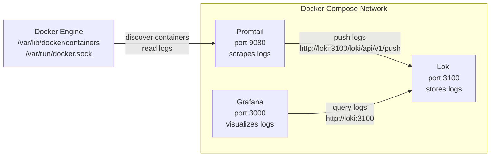
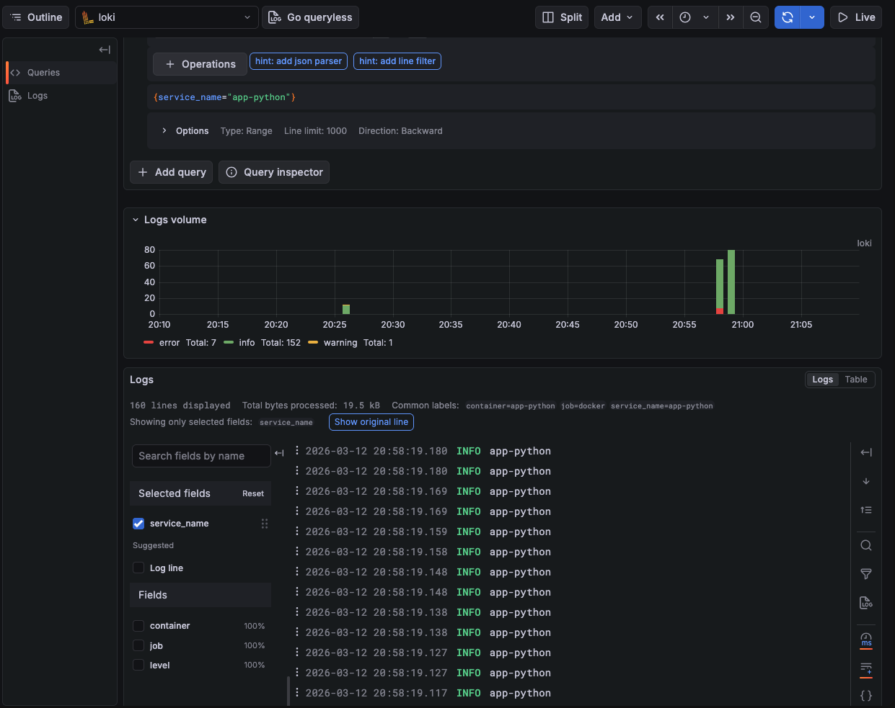
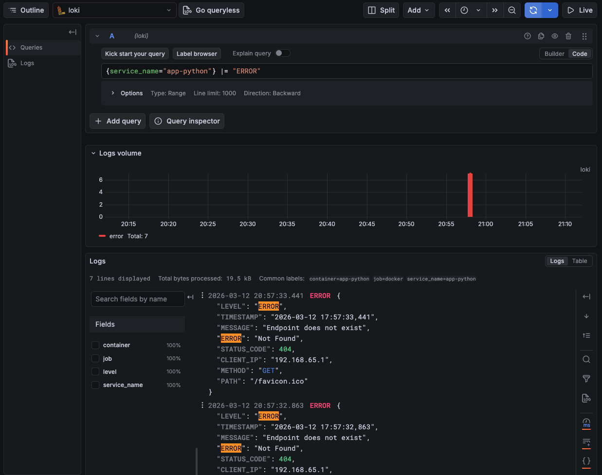
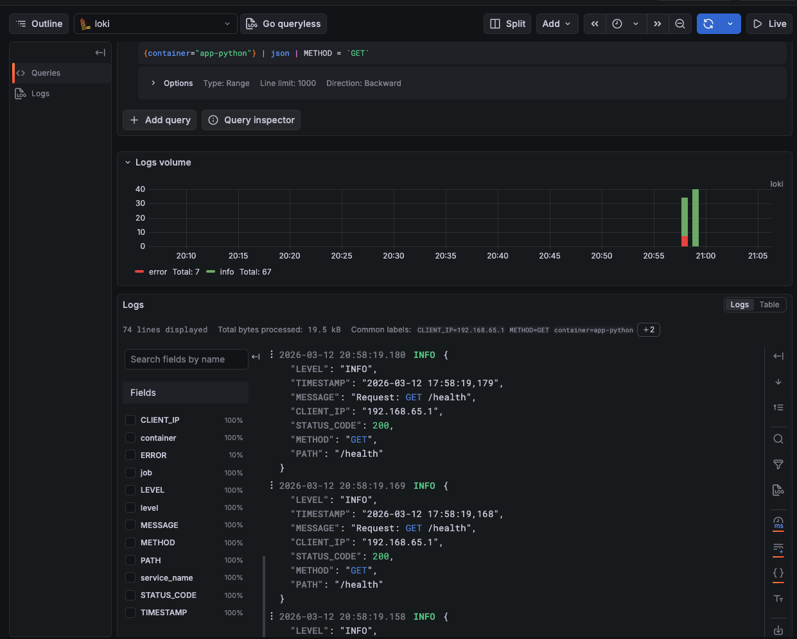
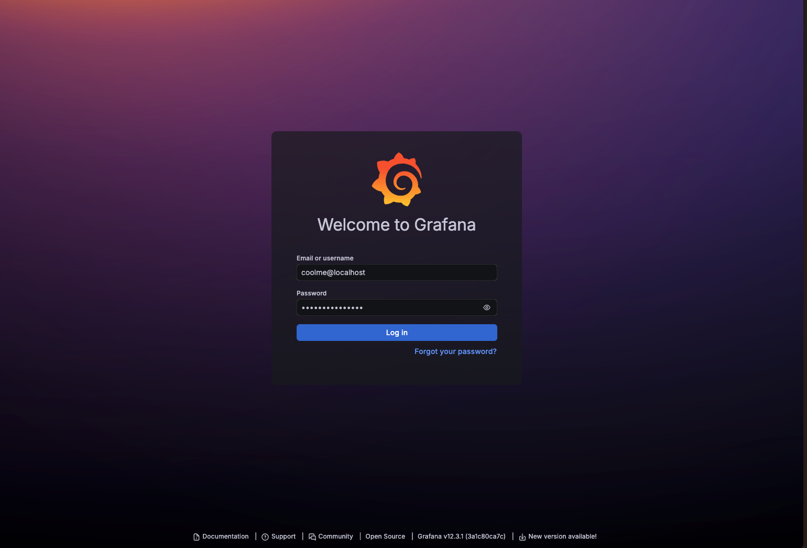

# Documentation

## Architecture (diagram showing how components connect, and the data flow)



## Setup Guide (step-by-step deployment instructions)

```bash
# make sure your docker compose is working
docker compose version  
```
```bash
# enter the monitoring directory
cd app_python/monitoring
```
```bash
# deploy the containers
docker compose up -d  
```
Important! Make sure you have your .env file with secrets GF_PASSWORD and GF_EMAIL for Grafana authorization.

## Configuration (explain your Loki/Promtail configs and why)

### Configuration file snippets for Loki

```bash
auth_enabled: false
# no authentication required
```

```bash
server:
  http_listen_port: 3100
# loki is listening on port 3100
```

```bash
# common values are shared among all modules if not redefined explicitly
common:
  path_prefix: /loki
  storage:
    # filesystem object store
    filesystem:
      chunks_directory: /loki/chunks
      rules_directory: /loki/rules
  # number of instances
  replication_factor: 1
  # hashes are stored in ram
  ring:
    kvstore:
      store: inmemory
```

```bash
# configures the schema for chunk index
schema_config:
  configs:
    # index buckets are created from this date
    - from: 2026-03-01
      # index type
      store: tsdb
      object_store: filesystem
      schema: v13
      index:
        # prefix for all created indices
        prefix: index_
        # the index is remade every 24 hours
        period: 24h
```

```bash
# storage config for chunks
storage_config:
  filesystem:
    directory: /loki/chunks
```
```bash
# logs are stored for 168 hours and then discarded
limits_config:
  retention_period: 168h
```

```bash
# compactor merges small index shards for performance and deletes old logs
compactor:
  working_directory: /loki/compactor
  retention_enabled: true
```

### Configuration file snippets for Promtail

```bash
server:
  # listening port for promtail itself
  http_listen_port: 9080
```
```bash
# positions help promtail to identify where it left of while reading the file
positions:
  filename: "/tmp/positions.yaml"
  sync_period: 10s
  ignore_invalid_yaml: false
```
```bash
# where promtail will push logs to
clients:
  - url: http://loki:3100/loki/api/v1/push
```
```bash
# discovery configs
scrape_configs:
  - job_name: docker
    docker_sd_configs:
      - host: unix:///var/run/docker.sock
        refresh_interval: 5s
    # relabeling
    relabel_configs:
      - source_labels: ['__meta_docker_container_name']
        # regex helps to remove / from container names
        regex: '/(.*)'
        target_label: 'container'
```

## Application Logging (how you implemented JSON logging)

I implemented logging using JsonFormatter from pythonjsonlogger.json. It has basic configured fields and I can add extra fields relating to the request from dedicated functions that handle connections.

### Screenshot of JSON log output from your app


## Dashboard (explain each panel and the LogQL queries)

### Screenshot showing logs from at least 3 containers in Grafana Explore


### Screenshots of Grafana showing logs from the app







### Screenshot of your dashboard showing all 4 panels with real data.

I have 4 panels:
- All collected logs ("Logs from all apps")
- The rate of getting logs ("Logs rate")
- A pie chart that shows the relative size of logs with different errors ("Level statistics")
- All collected error logs ("Error logs")


### Example LogQL queries with explanations (At least 3 different LogQL queries that work)

- all logs from the app: 
- - {service_name="app-python"}
- access all logs from the app which level is error: 
- - {service_name="app-python"} |= "ERROR"
- all logs where request method was GET: 
- - {service_name="app-python"} | json | METHOD = `GET`
- relative size of logs by levels: 
- - sum by (level) (count_over_time({service_name=~"app-.*"} | json [60m]))
- rate of logs: 
- - sum by (service_name) (rate({service_name=~"app-.*"} [120m]))
- error logs: 
- - {service_name=~"app-.*"} | json | LEVEL="ERROR"

## Production Config (security measures, resources, retention)

### Configuration file snippets

```bash
# healthchecks for loki and grafana to verify that containers are running and everything is okay
healthcheck:
      test: ["CMD-SHELL", "wget --no-verbose --tries=1 --spider http://localhost:3100/ready || exit 1"]
      interval: 10s
      timeout: 5s
      retries: 5
      start_period: 10s 
```

```bash
# resources limits: promtail, grafana, and app_python are pretty lightweight, but loki needs a lot of memory to store logs
deploy:
      resources:
        limits:
          cpus: "1.50"
          memory: 2G
        reservations:
          cpus: "0.50"
          memory: 512M
```

```bash
# now grafana requires login authorization, it is configured with .env file with environment variables
environment:
      - GF_AUTH_ANONYMOUS_ENABLED=false
      - GF_SECURITY_ADMIN_PASSWORD=${GF_PASSWORD}
      - GF_SECURITY_ADMIN_EMAIL=${GF_EMAIL}
```

### docker-compose ps showing all services healthy


### Screenshot of Grafana login page (no anonymous access)



## Testing (commands to verify everything works)

```bash
# check that the containers are up and healthy
docker compose ps
```

```bash
# check loki
curl http://localhost:3100/ready
```

```bash
# check promtail
curl http://localhost:9080/targets
```

```bash
# check grafana
open http://localhost:3000
```

## Challenges (problems you encountered and solutions)

- It was pretty hard for me to set up logging but after a long research it was done (I used python documentation and some guides to work out how JsonFormatter works with/without logging.BasicConfig())

- Also I was very confused about how to make promtail keep logs from a service with a specific label (I researched Stack Overflow and used AI a bit for this one)