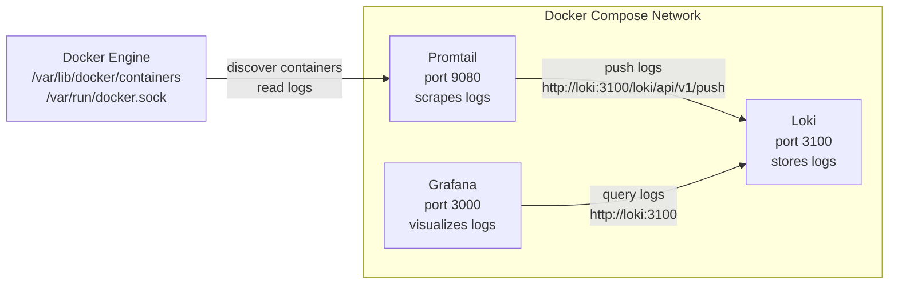
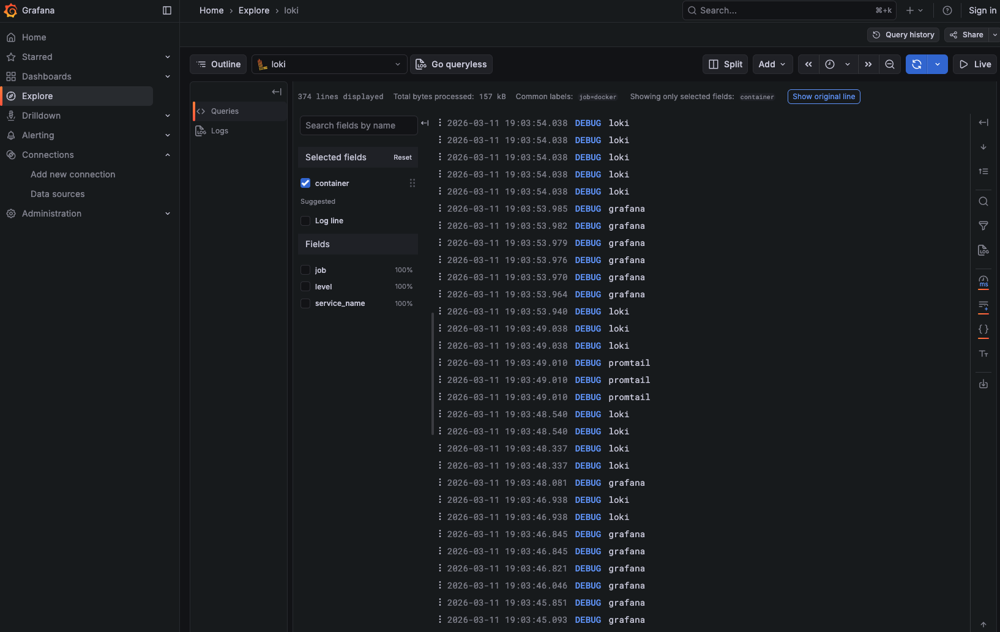

# Documentation

## Architecture (diagram showing how components connect, and the data flow)



## Setup Guide (step-by-step deployment instructions)

## Configuration (explain your Loki/Promtail configs and why)

### Configuration file snippets for Loki

```bash
auth_enabled: false
# no authentication required
```

```bash
server:
  http_listen_port: 3100
# loki is listening on port 3100
```

```bash
# common values are shared among all modules if not redefined explicitly
common:
  path_prefix: /loki
  storage:
    # filesystem object store
    filesystem:
      chunks_directory: /loki/chunks
      rules_directory: /loki/rules
  # number of instances
  replication_factor: 1
  # hashes are stored in ram
  ring:
    kvstore:
      store: inmemory
```

```bash
# configures the schema for chunk index
schema_config:
  configs:
    # index buckets are created from this date
    - from: 2026-03-01
      # index type
      store: tsdb
      object_store: filesystem
      schema: v13
      index:
        # prefix for all created indices
        prefix: index_
        # the index is remade every 24 hours
        period: 24h
```

```bash
# storage config for chunks
storage_config:
  filesystem:
    directory: /loki/chunks
```
```bash
# logs are stored for 168 hours and then discarded
limits_config:
  retention_period: 168h
```

```bash
# compactor merges small index shards for performance and deletes old logs
compactor:
  working_directory: /loki/compactor
  retention_enabled: true
```

### Configuration file snippets for Promtail

```bash
server:
  # listening port for promtail itself
  http_listen_port: 9080
```
```bash
# positions help promtail to identify where it left of while reading the file
positions:
  filename: "/tmp/positions.yaml"
  sync_period: 10s
  ignore_invalid_yaml: false
```
```bash
# where promtail will push logs to
clients:
  - url: http://loki:3100/loki/api/v1/push
```
```bash
# discovery configs
scrape_configs:
  - job_name: docker
    docker_sd_configs:
      - host: unix:///var/run/docker.sock
        refresh_interval: 5s
    # relabeling
    relabel_configs:
      - source_labels: ['__meta_docker_container_name']
        # regex helps to remove / from container names
        regex: '/(.*)'
        target_label: 'container'
```

## Application Logging (how you implemented JSON logging)

### Screenshot of JSON log output from your app

## Dashboard (explain each panel and the LogQL queries)

### Screenshot showing logs from at least 3 containers in Grafana Explore



### Screenshot of Grafana showing logs from both applications

### Screenshot of your dashboard showing all 4 panels with real data.

### Example LogQL queries with explanations (At least 3 different LogQL queries that work)

## Production Config (security measures, resources, retention)

### Configuration file snippets (not full files)

## Testing (commands to verify everything works)

### docker-compose ps showing all services healthy

### Screenshot of Grafana login page (no anonymous access)

## Challenges (problems you encountered and solutions)
