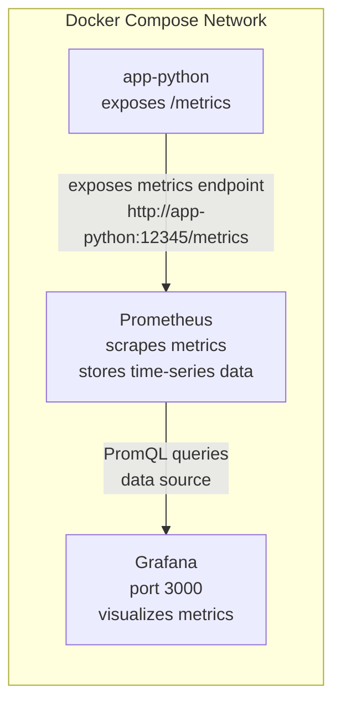
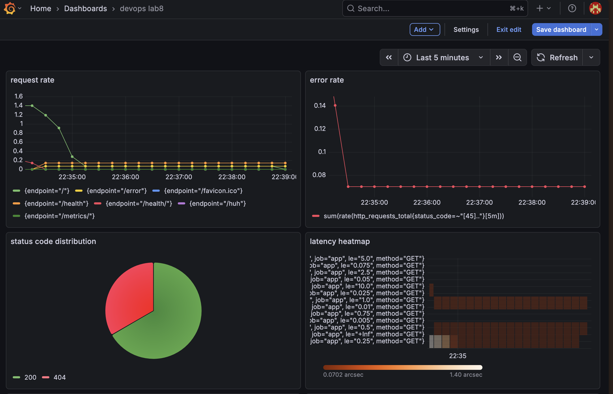
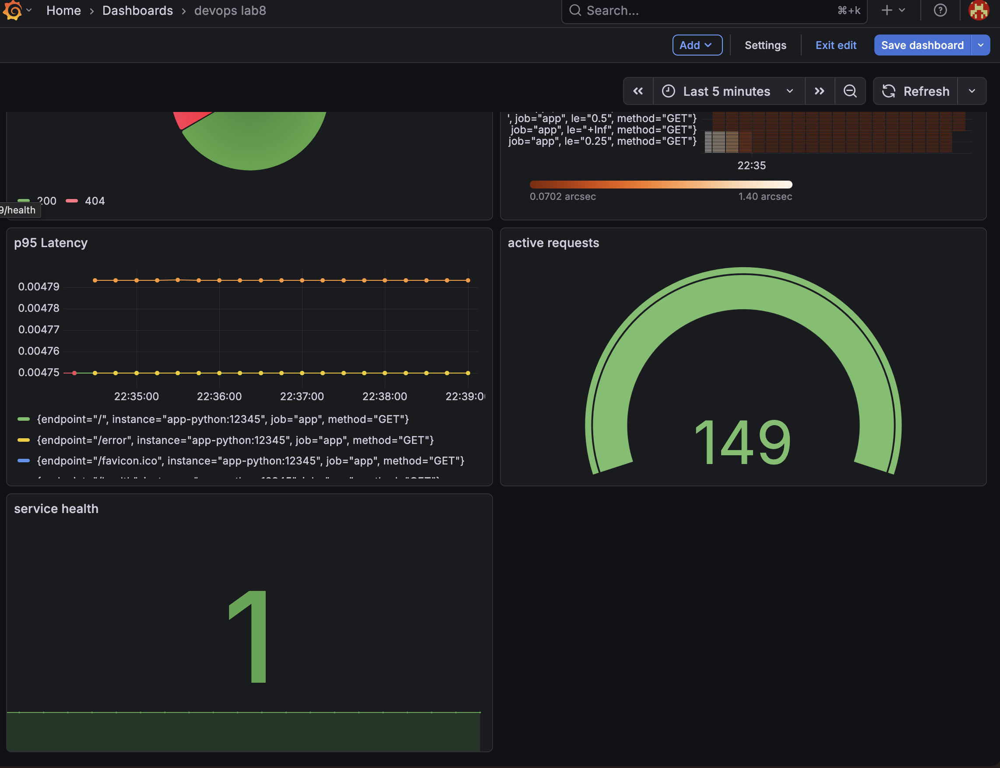
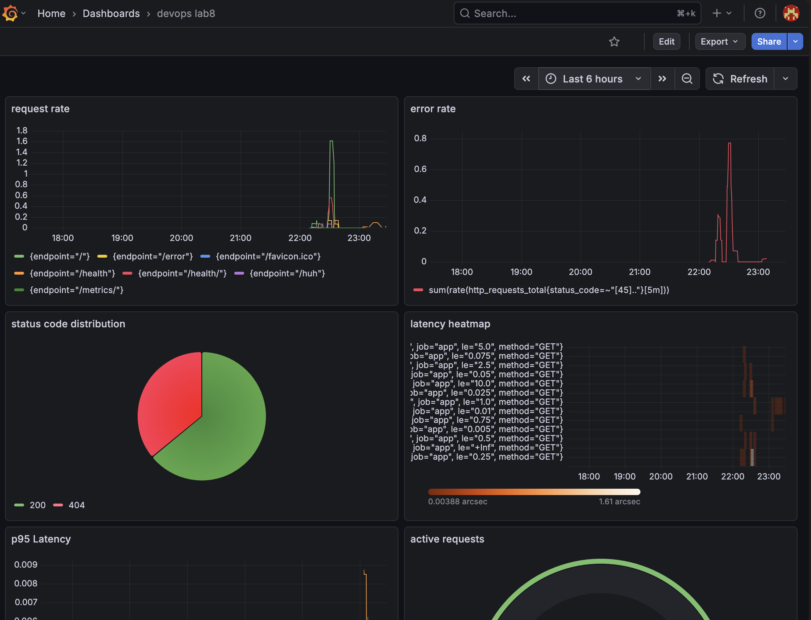

# Documentation

## Architecture - Diagram showing metric flow (app → Prometheus → Grafana)

### Comparison: metrics vs logs (Lab 7) - when to use each

- we use logs to see what has happened and metric to see the quantities: how much and how often.

## Application Instrumentation - What metrics you added and why

### Screenshot of /metrics endpoint output

### Code showing metric definitions

- you can see it in app.py
- sections: imports updated, Counter, Histogram, Gauge metrics defined, before request/after request decorators, metrics route decorator

### Documentation explaining your metric choices

- http_requests_total counts how many requests hit the service, so i can see overall traffic and usage patterns
- http_request_duration_seconds measures how long requests take, which helps spot slow endpoints or performance issues
- http_requests_in_progress tracks how many requests are being processed right now, useful for detecting load spikes
- endpoint_calls tracks how often each endpoint is used, so i can understand which parts of the service are actually used
- system_info_duration measures how long it takes to collect system info, mainly to check if that logic becomes slow over time

## Prometheus Configuration

### Screenshot of /targets page showing all targets UP

### Screenshot of a successful PromQL query

### prometheus.yml configuration file

- you can find it in ./app_python_monitoring/prometheous/prometheous.yml

## Dashboard Walkthrough 

### Each panel's purpose and query

- request rate — shows how many requests/sec the service gets per endpoint
[query: sum(rate(http_requests_total[5m])) by (endpoint)]

- error rate — shows how many failed requests (4xx/5xx) happen per second
[query: sum(rate(http_requests_total{status_code=~"[45].."}[5m]))]

- p95 latency — shows how slow requests are (95th percentile)
[query: histogram_quantile(0.95, rate(http_request_duration_seconds_bucket[5m]))]

- latency heatmap — shows distribution of request durations
[query: rate(http_request_duration_seconds_bucket[5m])]

- active requests — shows how many requests are currently being processed
[query: http_requests_in_progress]

- status codes — shows distribution of responses (2xx, 4xx, 5xx)
[query: sum by (status_code) (rate(http_requests_total[5m]))]

- service health — shows if the service is up (1) or down (0)
[query: up{job="app"}]

### Screenshots of dashboards with live data (all 6+ panels working)

### Exported dashboard JSON file

- you can find the file in ./app_python/monitoring/prometheus/dashboard.json

## PromQL Examples - 5+ queries with explanations

### PromQL queries that demonstrate RED method

### 5+ queries with explanations (red method)

- `sum(rate(http_requests_total[5m]))`  
  **rate**: total requests per second, shows overall traffic load  

- `sum(rate(http_requests_total{status_code=~"[45].."}[5m]))`  
  **errors**: failed requests per second (4xx + 5xx), shows reliability issues  

- `histogram_quantile(0.95, rate(http_request_duration_seconds_bucket[5m]))`  
  **duration**: p95 latency, shows how slow requests are  

- `sum by (endpoint) (rate(http_requests_total[5m]))`  
  **rate**: request rate per endpoint, helps see which endpoints are used most  

- `sum by (status_code) (rate(http_requests_total[5m]))`  
  **errors**: distribution of response codes, helps identify types of failures  

- `http_requests_in_progress`  
  **rate/load (approx)**: current number of active requests, useful to observe system load  

- `up{job="app"}`  
  **availability (related to errors)**: shows if service is reachable (1 = up, 0 = down)  

## Production Setup - Health checks, resources, retention policies

### docker compose ps showing all services healthy

### Documentation of retention policies

- prometheus is configured to keep metrics for 15 days and up to 10gb of data; this is defined using the retention time and size settings in the docker compose file. this helps to control disk usage and keeps the dataset smaller, which improves query performance. older data is automatically removed once the limits are reached, so the system doesn’t run out of storage.

### Proof of data persistence after restart

- if I set 6 hours range I still see my previous data

## Testing Results - Screenshots showing everything working

- you can see all required screenshots in the above sections

## Challenges & Solutions - Issues encountered and fixes

- my app-python container showed unhealty status because in the dockerfile no curl installation happened, I didn't think of it since in the VM it worked fine and I missed that those have different settings, once I added it to the Dockerfile and updated the image, it worked