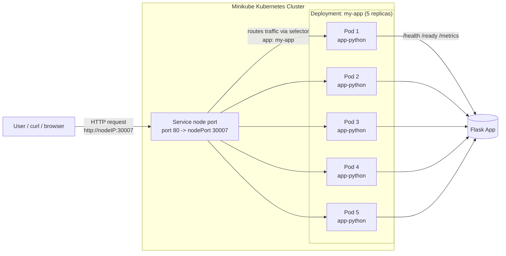
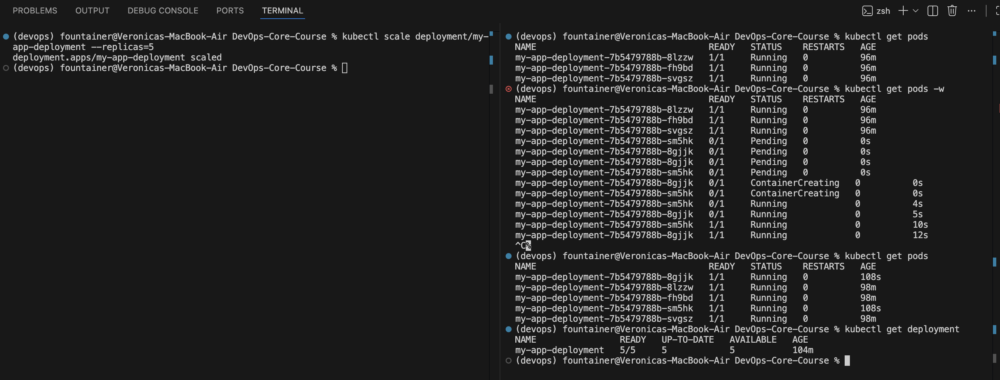
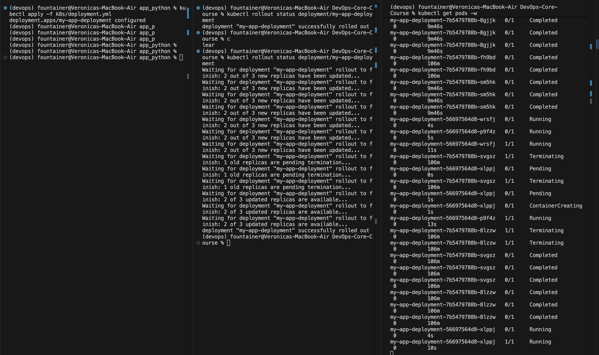

# Documentation

## Architecture Overview

### Diagram or description of your deployment architecture



### How many Pods, which Services, networking flow

- I used 5 pods managed by a deployment and one NodePort service, where traffic goes from the service (port 80 / nodePort 30007) to the pods using the app: my-app label selector.

### Resource allocation strategy

- I defined small cpu and memory requests/limits (100m–500m cpu, 128Mi–256Mi memory) to keep the app stable and prevent it from using too many cluster resources.

### Brief explanation of your chosen tool (minikube/kind) and why

I used minikube because it’s easy to set up locally and lets me run a full kubernetes cluster on my machine, which is enough for testing deployments without needing a real cloud setup.

## Manifest Files

### Brief description of each manifest

- Deployment: deployment.yml defines how my app runs in Kubernetes, including how many pods, which image to use, and how they are configured.

- Service: service.yml exposes the app inside and outside the cluster by routing traffic to the pods created by the deployment.

### Key configuration choices

- Deployment: I set 3 replicas, added resource limits/requests, configured liveness and readiness probes, used labels for selection, and set a rolling update strategy

- Service: I used NodePort type, matched the selector with app: my-app, set port 80 as the service port, and mapped it to container port 12345 with a fixed nodePort.

### Why you chose specific values (replicas, resources, etc.)

- Deployment: I used 3 replicas for basic availability, small cpu/memory values since the app is lightweight, and probes to make sure kubernetes can detect when the app is healthy and ready to serve traffic.

- Service: I used NodePort so i can access the app locally with minikube, port 80 for convenience, targetPort 12345 to match the app, and a fixed nodePort (30007) to make testing easier.

## Deployment Evidence

### Successful cluster setup

```bash
(devops) fountainer@Veronicas-MacBook-Air DevOps-Core-Course % minikube start                                                     

😄  minikube v1.38.1 on Darwin 26.3 (arm64)
✨  Using the docker driver based on existing profile
👍  Starting "minikube" primary control-plane node in "minikube" cluster
🚜  Pulling base image v0.0.50 ...
🏃  Updating the running docker "minikube" container ...
🐳  Preparing Kubernetes v1.35.1 on Docker 29.2.1 ...
🔎  Verifying Kubernetes components...
    ▪ Using image gcr.io/k8s-minikube/storage-provisioner:v5
🌟  Enabled addons: default-storageclass, storage-provisioner

❗  /Applications/Docker.app/Contents/Resources/bin/kubectl is version 1.32.2, which may have incompatibilities with Kubernetes 1.35.1.
    ▪ Want kubectl v1.35.1? Try 'minikube kubectl -- get pods -A'
🏄  Done! kubectl is now configured to use "minikube" cluster and "default" namespace by default
```
### Output of kubectl cluster-info and kubectl get nodes

```bash
(devops) fountainer@Veronicas-MacBook-Air k8s % kubectl cluster-info
Kubernetes control plane is running at https://127.0.0.1:51390
CoreDNS is running at https://127.0.0.1:51390/api/v1/namespaces/kube-system/services/kube-dns:dns/proxy

To further debug and diagnose cluster problems, use 'kubectl cluster-info dump'.
(devops) fountainer@Veronicas-MacBook-Air k8s % kubectl get nodes
NAME       STATUS   ROLES           AGE     VERSION
minikube   Ready    control-plane   6h45m   v1.35.1
```

### kubectl get all output

```bash
(devops) fountainer@Veronicas-MacBook-Air k8s % kubectl get all
NAME                                     READY   STATUS    RESTARTS   AGE
pod/my-app-deployment-6f67848dfb-kxbtv   1/1     Running   0          3m11s
pod/my-app-deployment-6f67848dfb-mjq8x   1/1     Running   0          3m11s
pod/my-app-deployment-6f67848dfb-vx95p   1/1     Running   0          3m11s

NAME                 TYPE        CLUSTER-IP   EXTERNAL-IP   PORT(S)   AGE
service/kubernetes   ClusterIP   10.96.0.1    <none>        443/TCP   6h58m

NAME                                READY   UP-TO-DATE   AVAILABLE   AGE
deployment.apps/my-app-deployment   3/3     3            3           3m11s

NAME                                           DESIRED   CURRENT   READY   AGE
replicaset.apps/my-app-deployment-6f67848dfb   3         3         3       3m11s
```
### kubectl get pods,svc with detailed view

```bash
(devops) fountainer@Veronicas-MacBook-Air k8s % kubectl get pods,svc
NAME                                     READY   STATUS    RESTARTS   AGE
pod/my-app-deployment-6f67848dfb-kxbtv   1/1     Running   0          3m35s
pod/my-app-deployment-6f67848dfb-mjq8x   1/1     Running   0          3m35s
pod/my-app-deployment-6f67848dfb-vx95p   1/1     Running   0          3m35s

NAME                 TYPE        CLUSTER-IP   EXTERNAL-IP   PORT(S)   AGE
service/kubernetes   ClusterIP   10.96.0.1    <none>        443/TCP   6h59m
```

### kubectl describe deployment <name> showing replicas and strategy

```bash
(devops) fountainer@Veronicas-MacBook-Air k8s % kubectl get pods
NAME                                 READY   STATUS    RESTARTS   AGE
my-app-deployment-6f67848dfb-kxbtv   1/1     Running   0          29s
my-app-deployment-6f67848dfb-mjq8x   1/1     Running   0          29s
my-app-deployment-6f67848dfb-vx95p   1/1     Running   0          29s
```
### Screenshot or curl output showing app working


### Service deployment

```bash
(devops) fountainer@Veronicas-MacBook-Air k8s % kubectl get services
NAME             TYPE        CLUSTER-IP      EXTERNAL-IP   PORT(S)        AGE
kubernetes       ClusterIP   10.96.0.1       <none>        443/TCP        38m
my-app-service   NodePort    10.98.179.244   <none>        80:30007/TCP   41s
(devops) fountainer@Veronicas-MacBook-Air k8s % minikube service my-app-service
┌───────────┬────────────────┬─────────────┬───────────────────────────┐
│ NAMESPACE │      NAME      │ TARGET PORT │            URL            │
├───────────┼────────────────┼─────────────┼───────────────────────────┤
│ default   │ my-app-service │ 80          │ http://192.168.49.2:30007 │
└───────────┴────────────────┴─────────────┴───────────────────────────┘
🔗  Starting tunnel for service my-app-service.
┌───────────┬────────────────┬─────────────┬────────────────────────┐
│ NAMESPACE │      NAME      │ TARGET PORT │          URL           │
├───────────┼────────────────┼─────────────┼────────────────────────┤
│ default   │ my-app-service │             │ http://127.0.0.1:57348 │
└───────────┴────────────────┴─────────────┴────────────────────────┘
🎉  Opening service default/my-app-service in default browser...
❗  Because you are using a Docker driver on darwin, the terminal needs to be open to run it.
```
```bash
(devops) fountainer@Veronicas-MacBook-Air k8s % kubectl get services
NAME             TYPE        CLUSTER-IP      EXTERNAL-IP   PORT(S)        AGE
kubernetes       ClusterIP   10.96.0.1       <none>        443/TCP        42m
my-app-service   NodePort    10.98.179.244   <none>        80:30007/TCP   4m16s
(devops) fountainer@Veronicas-MacBook-Air k8s % kubectl describe service my-app-service
Name:                     my-app-service
Namespace:                default
Labels:                   <none>
Annotations:              <none>
Selector:                 app=my-app
Type:                     NodePort
IP Family Policy:         SingleStack
IP Families:              IPv4
IP:                       10.98.179.244
IPs:                      10.98.179.244
Port:                     <unset>  80/TCP
TargetPort:               12345/TCP
NodePort:                 <unset>  30007/TCP
Endpoints:                10.244.0.16:12345,10.244.0.14:12345,10.244.0.15:12345
Session Affinity:         None
External Traffic Policy:  Cluster
Internal Traffic Policy:  Cluster
Events:                   <none>
(devops) fountainer@Veronicas-MacBook-Air k8s % kubectl get endpoints
Warning: v1 Endpoints is deprecated in v1.33+; use discovery.k8s.io/v1 EndpointSlice
NAME             ENDPOINTS                                               AGE
kubernetes       192.168.49.2:8443                                       42m
my-app-service   10.244.0.14:12345,10.244.0.15:12345,10.244.0.16:12345   4m36s
(devops) fountainer@Veronicas-MacBook-Air k8s % 
```

## Operations Performed

### Commands used to deploy

- ```bash kubectl apply -f k8s/deployment.yml```
- ```bash kubectl apply -f k8s/service.yml``` 
- ```bash kubectl get pods```
-  ```bash kubectl get services ```

### Scaling demonstration output



### Rolling update demonstration output

I changed ```bash image: fountainer/my-app:latest``` to ```bash image: fountainer/my-app:2026.03.26```.



### Service access method and verification

I accessed the app using ```bash minikube service my-app-service ``` and verified it by sending requests with curl to endpoints like /health and /ready.

## Production Considerations

### What health checks did you implement and why?

I implemented a liveness probe on /health to restart unhealthy containers and a readiness probe on /ready to ensure pods start receiving traffic only when they are ready to work.

### Resource limits rationale

- I set limits to prevent resource overuse, and requests to guarantee the pod gets enough cpu and memory to run reliably.

### How would you improve this for production?

- I would add proper logging/monitoring like we did in the previous labs, add autoscaling, consider other update strategies (like canary update).

### Monitoring and observability strategy

- In previous labs we used Prometheus for metrics and loki & promtail for logs, also Grafana for dashboard representation

## Challenges & Solutions

### Issues encountered

- I didn't work with NodePort before so I has to stydy it a little bit. Also I didn't know about minikube.

### How you debugged (logs, describe, events)

- I researched StackOverflow and other sources, such as documentation for kubernetes and minikube

### What you learned about Kubernetes

- I studied kubernetes in the SRE course last semester so I was already pretty familiar with it. We didn't use NodePort service though, and also didn't set up our own cluster since the course team provided us with it.

