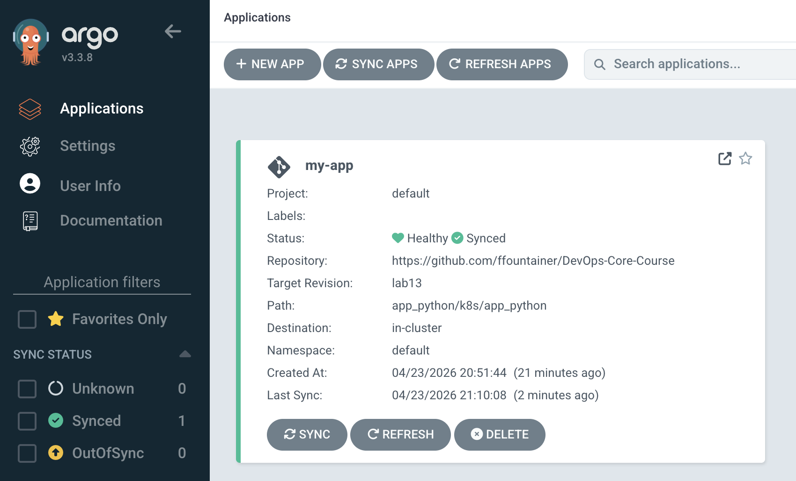
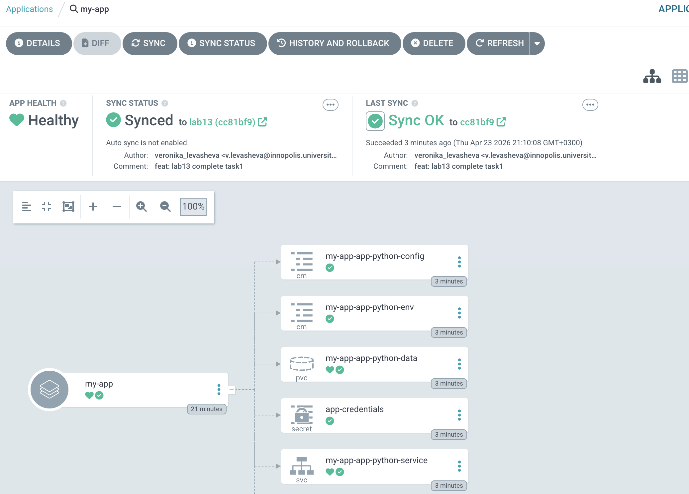

# Documentation

## ArgoCD Setup

### Installation verification

```bash
(devops) fountainer@Veronicas-MacBook-Air app_python % helm install argocd argo/argo-cd --namespace argocd
NAME: argocd
LAST DEPLOYED: Thu Apr 23 18:37:11 2026
NAMESPACE: argocd
STATUS: deployed
REVISION: 1
DESCRIPTION: Install complete
TEST SUITE: None
NOTES:
In order to access the server UI you have the following options:

1. kubectl port-forward service/argocd-server -n argocd 8080:443

    and then open the browser on http://localhost:8080 and accept the certificate

2. enable ingress in the values file `server.ingress.enabled` and either
      - Add the annotation for ssl passthrough: https://argo-cd.readthedocs.io/en/stable/operator-manual/ingress/#option-1-ssl-passthrough
      - Set the `configs.params."server.insecure"` in the values file and terminate SSL at your ingress: https://argo-cd.readthedocs.io/en/stable/operator-manual/ingress/#option-2-multiple-ingress-objects-and-hosts


After reaching the UI the first time you can login with username: admin and the random password generated during the installation. You can find the password by running:

kubectl -n argocd get secret argocd-initial-admin-secret -o jsonpath="{.data.password}" | base64 -d

(You should delete the initial secret afterwards as suggested by the Getting Started Guide: https://argo-cd.readthedocs.io/en/stable/getting_started/#4-login-using-the-cli)
(devops) fountainer@Veronicas-MacBook-Air app_python % helm list -n argocd
NAME    NAMESPACE       REVISION        UPDATED                                 STATUS          CHART           APP VERSION
argocd  argocd          1               2026-04-23 18:37:11.582773 +0300 MSK    deployed        argo-cd-9.5.4   v3.3.8     
(devops) fountainer@Veronicas-MacBook-Air app_python % 
```
```bash
(devops) fountainer@Veronicas-MacBook-Air DevOps-Core-Course % argocd version                        
argocd: v3.3.8+7ae7d2c.dirty
  BuildDate: 2026-04-21T20:19:34Z
  GitCommit: 7ae7d2cc723f5408b080a31263e705198af08613
  GitTreeState: dirty
  GitTag: v3.3.8
  GoVersion: go1.26.2
  Compiler: gc
  Platform: darwin/arm64
argocd-server: v3.3.8
  BuildDate: 2026-04-21T17:19:47Z
  GitCommit: 7ae7d2cc723f5408b080a31263e705198af08613
  GitTreeState: clean
  GitTag: v3.3.8
  GoVersion: go1.25.5
  Compiler: gc
  Platform: linux/arm64
  Kustomize Version: v5.8.1 2026-02-09T16:15:27Z
  Helm Version: v3.19.4+g7cfb6e4
  Kubectl Version: v0.34.0
  Jsonnet Version: v0.21.0
  ```

### UI access method

Accessed ArgoCD UI via kubectl port-forward to localhost and logged in through the browser using the admin credentials and a previously created password.

### CLI configuration

Installed the argocd CLI with Homebrew and connected to the server using argocd login localhost:8080 --insecure.

## Application Configuration

### Application manifests

### Source and destination configuration

### Values file selection

## Multi-Environment

### Dev vs Prod configuration differences

### Sync policy differences and rationale

### Namespace separation

## Self-Healing Evidence

### Manual scale test with before/after

### Pod deletion test

### Configuration drift test

### Explanation of behaviors

## Screenshots

### ArgoCD UI showing the application



### Sync status



### Application details view

