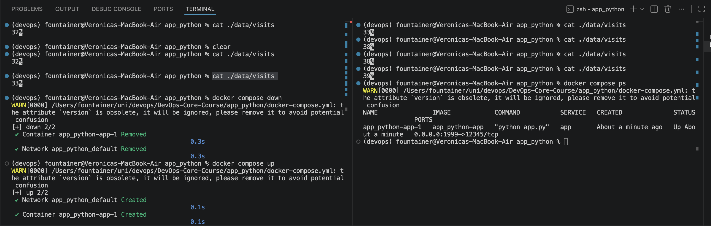

# Documentation

## Application Changes

###  Description of visits counter implementation
### New endpoint documentation
### Local testing evidence with Docker

Here you can see the counter value persistence across restarts.

## ConfigMap Implementation

### ConfigMap template structure
### config.json content
### How ConfigMap is mounted as file
### How ConfigMap provides environment variables
### Verification outputs

## Persistent Volume

### PVC configuration explanation
### Access modes and storage class discussion
### Volume mount configuration
### Persistence test evidence:
    - Counter value before pod deletion
    - Pod deletion command
    - Counter value after new pod starts

## ConfigMap vs Secret

### When to use ConfigMap
### When to use Secret
### Key differences

## Required Screenshots/Outputs:

### kubectl get configmap,pvc output
### File content inside pod (cat /config/config.json)
### Environment variables in pod

