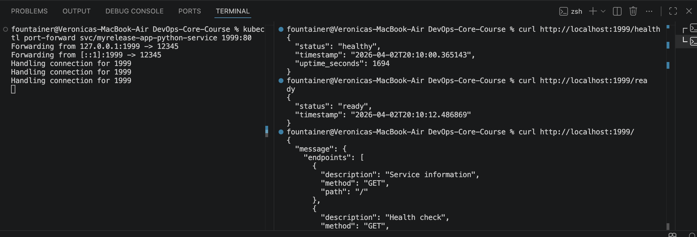

# Documentation

## Chart Overview

### Chart structure explanation
### Key template files and their purpose
### Values organization strategy

## Configuration Guide

### Important values and their purpose
### How to customize for different environments
### Example installations with different configurations

## Hook Implementation

### What hooks you implemented and why
### Hook execution order and weights
### Deletion policies explanation

## Installation Evidence

### Terminal output showing Helm installation and version (should be 4.x)

```bash
==> Fetching downloads for: helm
✔︎ Bottle Manifest helm (4.1.3)                                                                                                            Downloaded    7.4KB/  7.4KB
✔︎ Bottle helm (4.1.3)                                                                                                                     Downloaded   18.1MB/ 18.1MB
==> Pouring helm--4.1.3.arm64_tahoe.bottle.tar.gz
🍺  /opt/homebrew/Cellar/helm/4.1.3: 69 files, 61.3MB
==> Running `brew cleanup helm`...
Disable this behaviour by setting `HOMEBREW_NO_INSTALL_CLEANUP=1`.
Hide these hints with `HOMEBREW_NO_ENV_HINTS=1` (see `man brew`).
==> Caveats
zsh completions have been installed to:
  /opt/homebrew/share/zsh/site-functions
```
### Output of exploring a public chart (e.g., helm show chart prometheus-community/prometheus)

```bash
(devops) fountainer@Veronicas-MacBook-Air app_python % helm show chart prometheus-community/prometheus
annotations:
  artifacthub.io/license: Apache-2.0
  artifacthub.io/links: |
    - name: Chart Source
      url: https://github.com/prometheus-community/helm-charts
    - name: Upstream Project
      url: https://github.com/prometheus/prometheus
apiVersion: v2
appVersion: v3.11.0
dependencies:
- condition: alertmanager.enabled
  name: alertmanager
  repository: https://prometheus-community.github.io/helm-charts
  version: 1.34.*
- condition: kube-state-metrics.enabled
  name: kube-state-metrics
  repository: https://prometheus-community.github.io/helm-charts
  version: 7.2.*
- condition: prometheus-node-exporter.enabled
  name: prometheus-node-exporter
  repository: https://prometheus-community.github.io/helm-charts
  version: 4.52.*
- condition: prometheus-pushgateway.enabled
  name: prometheus-pushgateway
  repository: https://prometheus-community.github.io/helm-charts
  version: 3.6.*
description: Prometheus is a monitoring system and time series database.
home: https://prometheus.io/
icon: https://raw.githubusercontent.com/prometheus/prometheus.github.io/master/assets/prometheus_logo-cb55bb5c346.png
keywords:
- monitoring
- prometheus
kubeVersion: '>=1.19.0-0'
maintainers:
- email: gianrubio@gmail.com
  name: gianrubio
  url: https://github.com/gianrubio
- email: zanhsieh@gmail.com
  name: zanhsieh
  url: https://github.com/zanhsieh
- email: miroslav.hadzhiev@gmail.com
  name: Xtigyro
  url: https://github.com/Xtigyro
- email: naseem@transit.app
  name: naseemkullah
  url: https://github.com/naseemkullah
- email: rootsandtrees@posteo.de
  name: zeritti
  url: https://github.com/zeritti
name: prometheus
sources:
- https://github.com/prometheus/alertmanager
- https://github.com/prometheus/prometheus
- https://github.com/prometheus/pushgateway
- https://github.com/prometheus/node_exporter
- https://github.com/kubernetes/kube-state-metrics
type: application
version: 28.15.0
```

### helm list output

```bash
fountainer@Veronicas-MacBook-Air DevOps-Core-Course % helm list
NAME                    NAMESPACE       REVISION        UPDATED                                 STATUS          CHART                   APP VERSION
my-python-app-dev       default         1               2026-04-02 22:00:55.999506 +0300 MSK    deployed        app_python-0.1.0        1.0        
my-python-app-prod      default         1               2026-04-02 22:12:24.157572 +0300 MSK    deployed        app_python-0.1.0        1.0        
myrelease               default         1               2026-04-02 22:40:56.562009 +0300 MSK    deployed        app_python-0.1.0        1.0        
```

### kubectl get all showing deployed resources

```bash
fountainer@Veronicas-MacBook-Air DevOps-Core-Course % kubectl get all
NAME                                                 READY   STATUS    RESTARTS   AGE
pod/my-python-app-dev-app-python-7d7f699d85-kklth    1/1     Running   0          43m
pod/my-python-app-prod-app-python-74c5b97dd5-4mjjr   0/1     Running   0          31m
pod/my-python-app-prod-app-python-74c5b97dd5-6pm7l   0/1     Running   0          31m
pod/my-python-app-prod-app-python-74c5b97dd5-75dvc   0/1     Running   0          31m
pod/my-python-app-prod-app-python-74c5b97dd5-9v58s   0/1     Running   0          31m
pod/my-python-app-prod-app-python-74c5b97dd5-xktsb   0/1     Running   0          31m
pod/myrelease-app-python-569fb4b645-6v9dt            1/1     Running   0          2m32s
pod/myrelease-app-python-569fb4b645-8ws5n            1/1     Running   0          2m32s
pod/myrelease-app-python-569fb4b645-glt5r            1/1     Running   0          2m32s
pod/myrelease-app-python-569fb4b645-qtg4j            1/1     Running   0          2m32s
pod/myrelease-app-python-569fb4b645-rgppk            1/1     Running   0          2m32s

NAME                                            TYPE           CLUSTER-IP       EXTERNAL-IP   PORT(S)        AGE
service/kubernetes                              ClusterIP      10.96.0.1        <none>        443/TCP        8d
service/my-python-app-dev-app-python-service    NodePort       10.104.238.26    <none>        80:30007/TCP   43m
service/my-python-app-prod-app-python-service   LoadBalancer   10.101.156.227   <pending>     80:30008/TCP   31m
service/myrelease-app-python-service            NodePort       10.107.17.3      <none>        80:30009/TCP   2m32s

NAME                                            READY   UP-TO-DATE   AVAILABLE   AGE
deployment.apps/my-python-app-dev-app-python    1/1     1            1           43m
deployment.apps/my-python-app-prod-app-python   0/5     5            0           31m
deployment.apps/myrelease-app-python            5/5     5            5           2m32s

NAME                                                       DESIRED   CURRENT   READY   AGE
replicaset.apps/my-python-app-dev-app-python-7d7f699d85    1         1         1       43m
replicaset.apps/my-python-app-prod-app-python-74c5b97dd5   5         5         0       31m
replicaset.apps/myrelease-app-python-569fb4b645            5         5         5       2m32s
fountainer@Veronicas-MacBook-Air DevOps-Core-Course % 
```

### Hook execution output (kubectl get jobs)

```bash
fountainer@Veronicas-MacBook-Air DevOps-Core-Course % kubectl get jobs -w
NAME                               STATUS    COMPLETIONS   DURATION   AGE
myrelease-app-python-pre-install   Running   0/1                      0s
myrelease-app-python-pre-install   Running   0/1           0s         0s
myrelease-app-python-pre-install   Running   0/1           33s        33s
myrelease-app-python-pre-install   Running   0/1           43s        43s
myrelease-app-python-pre-install   SuccessCriteriaMet   0/1           44s        44s
myrelease-app-python-pre-install   Complete             1/1           44s        44s
myrelease-app-python-pre-install   Complete             1/1           44s        44s
myrelease-app-python-post-install   Running              0/1                      0s
myrelease-app-python-post-install   Running              0/1           0s         0s
myrelease-app-python-post-install   Running              0/1           5s         5s
myrelease-app-python-post-install   Running              0/1           15s        15s
myrelease-app-python-post-install   SuccessCriteriaMet   0/1           16s        16s
myrelease-app-python-post-install   Complete             1/1           16s        16s
myrelease-app-python-post-install   Complete             1/1           16s        16s
```

### Different environment deployments (dev vs prod)

- Dev

```bash
(devops) fountainer@Veronicas-MacBook-Air app_python % helm install my-python-app-dev k8s/app_python -f k8s/app_python/values-dev.yaml
NAME: my-python-app-dev
LAST DEPLOYED: Thu Apr  2 22:00:55 2026
NAMESPACE: default
STATUS: deployed
REVISION: 1
DESCRIPTION: Install complete
TEST SUITE: None
(devops) fountainer@Veronicas-MacBook-Air app_python % kubectl get pods
NAME                                            READY   STATUS    RESTARTS   AGE
my-python-app-dev-app-python-7d7f699d85-kklth   1/1     Running   0          2m20s
(devops) fountainer@Veronicas-MacBook-Air app_python % kubectl get svc
NAME                                   TYPE        CLUSTER-IP      EXTERNAL-IP   PORT(S)        AGE
kubernetes                             ClusterIP   10.96.0.1       <none>        443/TCP        7d23h
my-python-app-dev-app-python-service   NodePort    10.104.238.26   <none>        80:30007/TCP   2m27s
```

- Prod

```bash
(devops) fountainer@Veronicas-MacBook-Air app_python % helm install my-python-app-prod k8s/app_python -f k8s/app_python/values-prod.yaml
NAME: my-python-app-prod
LAST DEPLOYED: Thu Apr  2 22:12:24 2026
NAMESPACE: default
STATUS: deployed
REVISION: 1
DESCRIPTION: Install complete
TEST SUITE: None
(devops) fountainer@Veronicas-MacBook-Air app_python % kubectl get pod
NAME                                             READY   STATUS    RESTARTS   AGE
my-python-app-dev-app-python-7d7f699d85-kklth    1/1     Running   0          12m
my-python-app-prod-app-python-74c5b97dd5-4mjjr   0/1     Running   0          38s
my-python-app-prod-app-python-74c5b97dd5-6pm7l   0/1     Running   0          38s
my-python-app-prod-app-python-74c5b97dd5-75dvc   0/1     Running   0          38s
my-python-app-prod-app-python-74c5b97dd5-9v58s   0/1     Running   0          38s
my-python-app-prod-app-python-74c5b97dd5-xktsb   0/1     Running   0          38s
(devops) fountainer@Veronicas-MacBook-Air app_python % kubectl get svc
NAME                                    TYPE           CLUSTER-IP       EXTERNAL-IP   PORT(S)        AGE
kubernetes                              ClusterIP      10.96.0.1        <none>        443/TCP        7d23h
my-python-app-dev-app-python-service    NodePort       10.104.238.26    <none>        80:30007/TCP   12m
my-python-app-prod-app-python-service   LoadBalancer   10.101.156.227   <pending>     80:30008/TCP   49s
```


## Operations

### Installation commands used

```bash
helm install name-of-new-release k8s/app_python -f k8s/app_python/values-for-new-release.yaml
```
### How to upgrade a release
### How to rollback
### How to uninstall

```bash
helm uninstall name-of-release 
```

## Testing & Validation

### helm lint output

```bash
(devops) fountainer@Veronicas-MacBook-Air k8s % helm lint app_python
==> Linting app_python
[INFO] Chart.yaml: icon is recommended

1 chart(s) linted, 0 chart(s) failed
```
### helm template verification

```bash
(devops) fountainer@Veronicas-MacBook-Air app_python % helm template app-python k8s/app_python
---
# Source: app_python/templates/service.yaml
apiVersion: v1
kind: Service
metadata:
  name: app-python-app-python-service
spec:
  type: NodePort
  selector:
      app.kubernetes.io/name: app-python
      app.kubernetes.io/instance: app-python
  ports:
    - protocol: TCP
      port: 80
      targetPort: 12345
      nodePort: 30007
---
# Source: app_python/templates/deployment.yaml
apiVersion: apps/v1
kind: Deployment
metadata:
  name: app-python-app-python
  labels:
    helm.sh/chart: app_python-0.1.0
    app.kubernetes.io/name: app-python
    app.kubernetes.io/instance: app-python
    app.kubernetes.io/version: "1.0"
    app.kubernetes.io/managed-by: Helm
spec:
  replicas: 5
  strategy:
    type: RollingUpdate
    rollingUpdate:
      maxUnavailable: 1
      maxSurge: 1
  selector:
    matchLabels:
      app.kubernetes.io/name: app-python
      app.kubernetes.io/instance: app-python
  template:
    metadata:
      labels:
        app.kubernetes.io/name: app-python
        app.kubernetes.io/instance: app-python
    spec:
      containers:
        - name: app-python
          image: "fountainer/my-app:2026.03.26"
          imagePullPolicy: IfNotPresent
          ports:
            - containerPort: 12345
          resources:
            requests:
              cpu: 100m
              memory: 128Mi
            limits:
              cpu: 500m
              memory: 256Mi
          livenessProbe:
            httpGet:
              path: /health
              port: 12345
            initialDelaySeconds: 10
            periodSeconds: 10
            timeoutSeconds: 5
            failureThreshold: 5
          readinessProbe:
            httpGet:
              path: /ready
              port: 12345
            initialDelaySeconds: 5
            periodSeconds: 5
```

### Dry-run output

```bash
(devops) fountainer@Veronicas-MacBook-Air app_python % helm install --dry-run --debug test-release k8s/app_python
level=WARN msg="--dry-run is deprecated and should be replaced with '--dry-run=client'"
level=DEBUG msg="Original chart version" version=""
level=DEBUG msg="Chart path" path=/Users/fountainer/uni/devops/DevOps-Core-Course/app_python/k8s/app_python
level=DEBUG msg="number of dependencies in the chart" chart=app_python dependencies=0
NAME: test-release
LAST DEPLOYED: Thu Apr  2 21:46:17 2026
NAMESPACE: default
STATUS: pending-install
REVISION: 1
DESCRIPTION: Dry run complete
TEST SUITE: None
USER-SUPPLIED VALUES:
{}

COMPUTED VALUES:
container:
  port: 12345
image:
  pullPolicy: IfNotPresent
  repository: fountainer/my-app
  tag: 2026.03.26
livenessProbe:
  failureThreshold: 5
  initialDelaySeconds: 10
  path: /health
  periodSeconds: 10
  timeoutSeconds: 5
readinessProbe:
  initialDelaySeconds: 5
  path: /ready
  periodSeconds: 5
replicaCount: 5
resources:
  limits:
    cpu: 500m
    memory: 256Mi
  requests:
    cpu: 100m
    memory: 128Mi
service:
  nodePort: 30007
  port: 80
  protocol: TCP
  targetPort: 12345
  type: NodePort
strategy:
  maxSurge: 1
  maxUnavailable: 1

HOOKS:
MANIFEST:
---
# Source: app_python/templates/service.yaml
apiVersion: v1
kind: Service
metadata:
  name: test-release-app-python-service
spec:
  type: NodePort
  selector:
      app.kubernetes.io/name: app-python
      app.kubernetes.io/instance: test-release
  ports:
    - protocol: TCP
      port: 80
      targetPort: 12345
      nodePort: 30007
---
# Source: app_python/templates/deployment.yaml
apiVersion: apps/v1
kind: Deployment
metadata:
  name: test-release-app-python
  labels:
    helm.sh/chart: app_python-0.1.0
    app.kubernetes.io/name: app-python
    app.kubernetes.io/instance: test-release
    app.kubernetes.io/version: "1.0"
    app.kubernetes.io/managed-by: Helm
spec:
  replicas: 5
  strategy:
    type: RollingUpdate
    rollingUpdate:
      maxUnavailable: 1
      maxSurge: 1
  selector:
    matchLabels:
      app.kubernetes.io/name: app-python
      app.kubernetes.io/instance: test-release
  template:
    metadata:
      labels:
        app.kubernetes.io/name: app-python
        app.kubernetes.io/instance: test-release
    spec:
      containers:
        - name: app-python
          image: "fountainer/my-app:2026.03.26"
          imagePullPolicy: IfNotPresent
          ports:
            - containerPort: 12345
          resources:
            requests:
              cpu: 100m
              memory: 128Mi
            limits:
              cpu: 500m
              memory: 256Mi
          livenessProbe:
            httpGet:
              path: /health
              port: 12345
            initialDelaySeconds: 10
            periodSeconds: 10
            timeoutSeconds: 5
            failureThreshold: 5
          readinessProbe:
            httpGet:
              path: /ready
              port: 12345
            initialDelaySeconds: 5
            periodSeconds: 5

```
### Application accessibility verification

